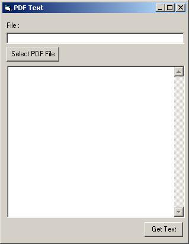



## PDF Text Extracter

### Description

The code will extract any text found in a PDF document and display to a text box. You must have Adobe Acrobat NOT the reader. the reader will not work. also the text cannot be an image otherwise all it will return is garbage.
 
### More Info
 

             |
---                |---
**Submitted On**   |2001-02-13 14:19:28
**By**             |[gandu](https://github.com/Planet-Source-Code/PSCIndex/blob/master/ByAuthor/gandu.md)
**Level**          |Advanced
**User Rating**    |4.7 (52 globes from 11 users)
**Compatibility**  |VB 5\.0, VB 6\.0
**Category**       |[Miscellaneous](https://github.com/Planet-Source-Code/PSCIndex/blob/master/ByCategory/miscellaneous__1-1.md)
**World**          |[Visual Basic](https://github.com/Planet-Source-Code/PSCIndex/blob/master/ByWorld/visual-basic.md)
**Archive File**   |[CODE\_UPLOAD149292132001\.zip](https://github.com/Planet-Source-Code/gandu-pdf-text-extracter__1-20981/archive/master.zip)

